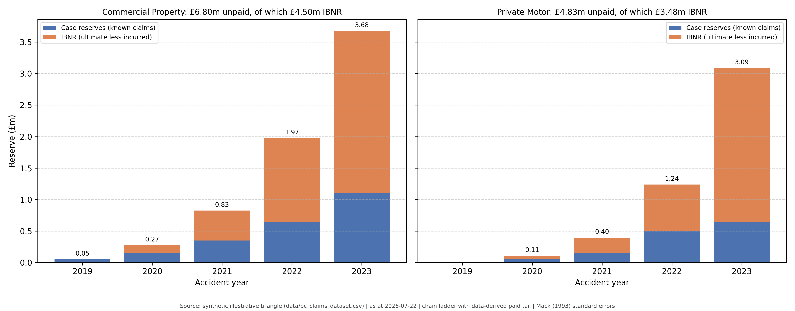

# P&C Claims Analytics & Actuarial Reserving Engine

Loss development triangles, chain-ladder and Bornhuetter-Ferguson projections, a
data-derived tail factor, and Mack (1993) reserve variability, across a Commercial
Property and a Private Motor portfolio.

> **Data notice.** The triangle in `data/` is **synthetic and illustrative**: 30 rows
> covering two lines of business, accident years 2019 to 2023, development years 0 to 4.
> It is deliberately smooth, which matters for interpretation (see
> [Limitations](#limitations)). It is not a real book of business.

**The reserving arithmetic is validated against an external benchmark.** The Mack
standard-error implementation reproduces the published per-accident-year standard
errors for the Taylor & Ashe (1983) triangle exactly, to the pound, in
`tests/test_reserving.py::TestMackAgainstPublishedBenchmark`. That is an independent
oracle rather than a self-consistency check.

---

## Commercial Property reserving summary

Generated by `src/claims_analysis.py` from `outputs/reserving_summary.csv`. Not hand-typed.

| Accident Year | Latest Paid | Case Reserves | CDF to Ultimate | Ultimate | Total Unpaid | IBNR | Mack SE | 75th %ile | CL Loss Ratio |
|---|---|---|---|---|---|---|---|---|---|
| **2019** | £3,750,000 | £50,000 | 1.0133 | £3,800,000 | £50,000 | £0 | £0 | £50,000 | 76.0% |
| **2020** | £3,900,000 | £150,000 | 1.0704 | £4,174,648 | £274,648 | £124,648 | £21,461 | £289,124 | 79.5% |
| **2021** | £3,800,000 | £350,000 | 1.2175 | £4,626,513 | £826,513 | £476,513 | £54,550 | £863,307 | 84.1% |
| **2022** | £3,050,000 | £650,000 | 1.6472 | £5,023,992 | £1,973,992 | £1,323,992 | £60,737 | £2,014,959 | 86.6% |
| **2023** | £1,850,000 | £1,100,000 | 2.9873 | £5,526,531 | £3,676,531 | £2,576,531 | £88,988 | £3,736,554 | 90.6% |
| **Total** | | £2,300,000 | | | £6,801,685 | £4,501,685 | | | |



### These are three different numbers

An earlier version of this repo reported the first of these under the name of the third.

| Quantity | Definition | Commercial Property total |
|---|---|---|
| Total unpaid (outstanding) | Ultimate less cumulative paid | £6,801,685 |
| Case reserves | Incurred less cumulative paid, set by handlers on known claims | £2,300,000 |
| **IBNR** | **Ultimate less incurred**, equivalently unpaid less case | **£4,501,685** |

Reporting total unpaid as IBNR overstates the IBNR provision by the entire case
reserve. On AY2020 that is £274,648 reported against a true IBNR of £124,648, an
overstatement of **3.15x**. The incurred triangle needed to make the split was already
in the dataset and was going unused.

---

## Recommendation

**Commercial Property needs a reserve strengthening review.** The projected ultimate
loss ratio deteriorates from **76.0% (AY2019) to 90.6% (AY2023), 14.6 points**, and the
deterioration is monotonic across all five accident years. Private Motor moves 6.5
points over the same period and stays below 75%.

- **Held reserve required:** £6.80m total unpaid on Commercial Property, of which
  £4.50m is IBNR. At the 75th percentile the figure is £6.95m; at the 95th, £7.15m.
- **The 2023 signal is the one to act on:** £3.68m of the £6.80m sits in the single
  least mature accident year, where the CDF is 2.9873 and only one development period
  has been observed. Chain ladder and Bornhuetter-Ferguson disagree by **10.4 points**
  of loss ratio on that year, which is the widest gap on the book and the honest
  measure of how little is known.
- **Where the two methods diverge, prefer BF for AY2023.** Chain ladder multiplies a
  single immature diagonal by 2.99, so one unusual large claim moves the whole
  ultimate. BF anchors to the plan loss ratio and is the more stable estimator at that
  maturity.

**Owner:** Chief Actuary, with Claims Operations on the case-reserve adequacy question.
**Decision required by:** the next quarterly reserving committee.
**Trigger for escalation:** ultimate loss ratio above 90% on any line, or chain ladder
and BF diverging by more than 10 points on an accident year representing over 25% of
held reserve. Both conditions are currently met on Commercial Property AY2023.

---

## Method

```
Paid + incurred triangles (data/pc_claims_dataset.csv)
        |
        v
Volume-weighted age-to-age factors  f_k = sum C_{i,k+1} / sum C_{i,k}
        |
        v
Tail factor derived from the oldest year's open case reserve
        |
        v
CDF to ultimate  ->  Chain ladder ultimate
                 ->  Bornhuetter-Ferguson (a priori loss ratio x percent unreported)
                 ->  Mack (1993) standard error, 75th / 95th percentiles
        |
        v
Reserve decomposition: case reserves vs IBNR
```

**Tail factor.** Not assumed to be 1.0. It is derived from the incurred-to-paid ratio
on the oldest accident year at its final observed development year:

- Commercial Property: **1.013333**. AY2019 still shows £50,000 of open case reserve at
  DY4, so the paid triangle is not fully run off.
- Private Motor: **1.000000**. AY2019 is fully settled at DY4, so no tail is warranted.
  This is a derived result, not an assumption.

---

## Limitations

These are the reasons not to over-read the output.

- **The data is too smooth.** Coefficients of variation come out at 1.2% to 7.8%.
  Real reserving triangles produce materially wider ranges. The synthetic data has
  almost no process variance, so Mack's sigma parameters are near zero and the
  uncertainty shown here is **understated by construction**. The method is right; the
  data is too well behaved to exercise it.
- **The terminal development factor rests on a single accident year.** Only AY2019
  contributes to f_3. It is reported to four decimal places, which implies a precision
  the one observation cannot support. No credibility weighting is applied.
- **The tail carries no estimated variance.** It is applied to the ultimate but is not
  itself in the Mack error term, so total uncertainty is understated further.
- **The BF a priori is an input, not a result.** Both lines use 0.75. The BF reserve
  scales directly with it and should be sensitivity-tested against the pricing plan.
- **No discounting and no risk margin.** This is an undiscounted best estimate. A
  Solvency II technical provision requires discounting plus a risk margin, and IFRS 17
  requires a risk adjustment. Neither is implemented here, so this output is an input
  to those calculations, not a substitute for them.
- **Paid triangle only.** An incurred-basis chain ladder and a paid-incurred
  reconciliation would be the normal next step.

---

## Repository layout

```
data/        synthetic paid + incurred triangle
src/         reserving.py (all arithmetic) + claims_analysis.py (reporting)
tests/       Taylor-Ashe benchmark, hand-computed oracles, decomposition tests
docs/        BRD.md with a requirements traceability matrix
notebooks/   walkthrough
outputs/     summary CSV, generated README table, charts
app.py       Streamlit console
```

## How to run

```bash
git clone https://github.com/sach98/pc-claims-loss-reserving-analytics.git
cd pc-claims-loss-reserving-analytics
pip install -r requirements.txt

python3 -m src.claims_analysis        # regenerates outputs/ and the README table
python3 -m unittest discover -s tests # behavioural + benchmark test suite
streamlit run app.py
```

---

## References

- Mack, T. (1993). Distribution-free calculation of the standard error of chain ladder
  reserve estimates. *ASTIN Bulletin* 23(2), 213-225.
- Taylor, G. and Ashe, F. (1983). Second moments of estimates of outstanding claims.
  *Journal of Econometrics* 23, 37-61.

## Business analysis artifacts

- **[docs/BRD.md](docs/BRD.md)** — requirements, formulas, and the traceability matrix.
