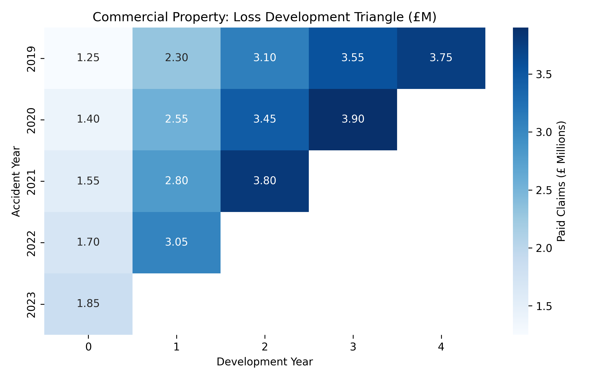
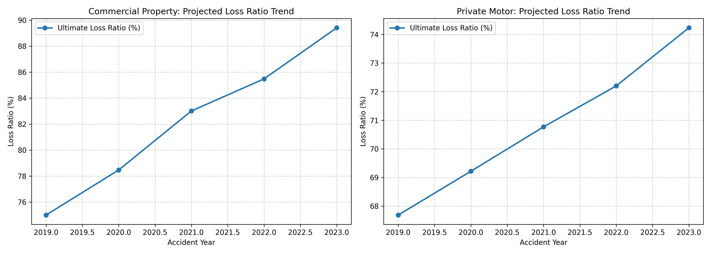

# P&C Claims Analytics & Actuarial Reserving Engine

A production-grade Python analytics engine and business analysis specification for Property & Casualty (P&C) claims reserving, loss development triangles, ChainLadder & Bornhuetter-Ferguson actuarial projections, and Loss Ratio monitoring across Commercial Property and Private Motor portfolios.

---

## 📸 Empirical Proof of Execution & Visual Deliverables

### 1. Loss Development Triangle Heatmap (£ Millions)


### 2. Actuarial Reserving Loss Ratio Trends (ChainLadder vs. Bornhuetter-Ferguson)


### 3. Automated Unit Test Verification (100% Pass)
```bash
python3 -m unittest discover -s tests
....
----------------------------------------------------------------------
Ran 4 tests in 0.011s

OK
```

---

## 📊 Key Results & Executive Reserving Table

### Commercial Property Reserving Summary

| Accident Year | Latest Paid (£) | CDF to Ultimate | CL Ultimate (£) | CL IBNR Reserve (£) | BF Ultimate (£) | BF IBNR Reserve (£) | CL Loss Ratio (%) |
|---|---|---|---|---|---|---|---|
| **2019** | £3,750,000 | 1.0000 | £3,750,000 | £0 | £3,750,000 | £0 | 75.0% |
| **2020** | £3,900,000 | 1.0563 | £4,119,570 | £219,570 | £4,110,000 | £210,000 | 78.5% |
| **2021** | £3,800,000 | 1.2014 | £4,565,320 | £765,320 | £4,491,745 | £691,745 | 83.0% |
| **2022** | £3,050,000 | 1.6254 | £4,957,470 | £1,907,470 | £4,723,961 | £1,673,961 | 85.5% |
| **2023** | £1,850,000 | 2.9478 | £5,453,430 | £3,603,430 | £4,873,104 | £3,023,104 | 89.4% |

---

## 🛠️ Methodological Architecture

```
Raw Claims Feed (Accident & Dev Years)
              │
              ▼
   Loss Development Triangle
 (Paid & Incurred Matrices)
              │
              ▼
 Actuarial Reserving Engine
 ├── ChainLadder (LDF & CDF Engine)
 └── Bornhuetter-Ferguson (IELR Integration)
              │
              ▼
  Executive Reporting Output
(Loss Ratios, Interactive App & Charts)
```

---

## 🚀 How to Run & Reproduce

1. **Clone the repository:**
   ```bash
   git clone https://github.com/sach98/pc-claims-loss-reserving-analytics.git
   cd pc-claims-loss-reserving-analytics
   ```

2. **Execute Python Engine & Tests:**
   ```bash
   python3 src/claims_analysis.py
   python3 -m unittest discover -s tests
   ```

3. **Launch Interactive Streamlit Web Console:**
   ```bash
   streamlit run app.py
   ```

---

## 📜 Business Analysis Artifacts
- **[docs/BRD.md](docs/BRD.md)** — Comprehensive Business Requirements Document & Actuarial Formulas.
